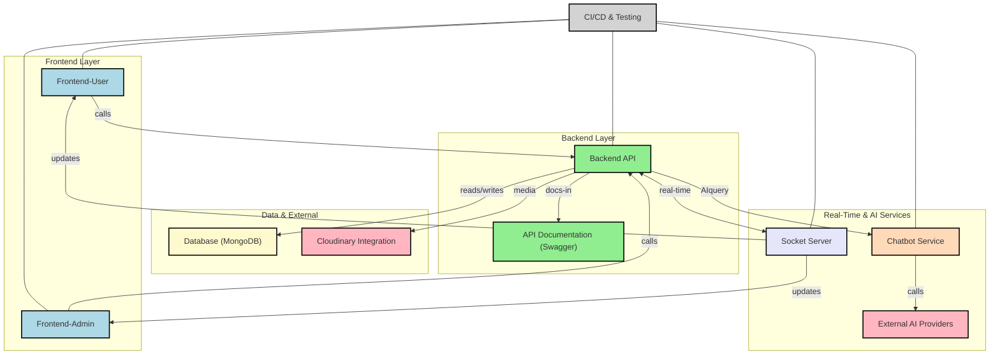

<p align="center">
  <a href="https://www.uit.edu.vn/" title="University of Information Technology" style="border: none;">
    
  </a>
</p>

<h1 align="center"><b>IE213.P21 - Web Systems Development Techniques</b></h1>

## Project Group:
| **No.** | **Student ID** | **Full Name**            | **Role**        | **Email**                  |
| ------- | -------------- | ------------------------ | --------------- | -------------------------- |
| 1       | 22521172       | Võ Nhất Phương           | Group Leader    | 22521172@gm.uit.edu.vn     |
| 2       | 22521641       | Nguyễn Đăng Hương Uyên   | Member          | 22521641@gm.uit.edu.vn     |
| 3       | 22520298       | Lê Nguyễn Thùy Dương     | Member          | 22520298@gm.uit.edu.vn     |
| 4       | 22520861       | Hoàng Gia Minh           | Member          | 22520861@gm.uit.edu.vn     |

## Course Introduction:
* **Course Title:** Web Systems Development Techniques  
* **Course Code:** IE213.P21  
* **Academic Year:** Semester 2 (2024 - 2025)  
* **Instructor:** MSc. Võ Tấn Khoa

Vibely Educational Social Web
============

The Vibely educational social networking website is an online platform that combines social media features like Facebook (friending, messaging, and posting) with study support tools (viewing study materials, the Pomodoro technique, scheduling timetables, countdown timers for university entrance exams, and taking quizzes). This platform enables students to interact, share knowledge and resources, and support each other throughout their learning journey.


[](https://opensource.org/licenses/MIT)
* * * * *

Table of Contents
-----------------

- [Vibely Educational Social Web](#vibely-educational-social-web)
  - [Table of Contents](#table-of-contents)
  - [Features](#features)
    - [**User Features**:](#user-features)
    - [**Admin Features**:](#admin-features)
  - [Tech Stack](#tech-stack)
  - [System Architecture](#system-architecture)
  - [Running the Project](#running-the-project)
    - [Prerequisites](#prerequisites)
    - [Optional Tools](#optional-tools)
    - [Steps](#steps)
  - [Setting Up Environment Variables](#setting-up-environment-variables)
  - [Running the Project](#running-the-project-1)
    - [Local Development](#local-development)
    - [Using Docker](#using-docker)
      - [Access the Application](#access-the-application)
  - [CI/CD Pipeline and Deployment](#cicd-pipeline-and-deployment)
    - [Implementation Process](#implementation-process)
    - [Deployment Process](#deployment-process)

* * * * *
Features
--------

### **User Features**:
-   Sign up, log in, log out, reset password
-   Create, view and like stories
-   Create, view, edit, delete and interact with posts and videos (react, comment, share)
-   Send and accept friend requests
-   Search for other users
-   View, save and share study materials
-   Countdown timer for university entrance exams
-   View weather forecasts
-   Pomodoro mode for focused study sessions
-   Take quizzes to test knowledge
-   Plan study schedules
-   Chat with friends
-   View notifications
-   View other users' profiles
-   Manage account and profile settings
-   Help center and submit inquiries
-   Interact with AI Chatbot for study support
-   🌱 Upcoming Feature (in development):
Grow a Learning Tree - Complete your learning goals to grow your tree and unlock achievement badges
### **Admin Features**:
-   View statistical reports
-   Manage users
-   Manage posts
-   Manage study materials
-   Manage quizs
-   Manage inquiries
-   Change password
-   Admin account management
* * * * *

Tech Stack
----------

-   **Frontend**: HTML, Tailwind CSS, React.js, Next.js, Zustand
-   **Backend**: Node.js, Express.js, JWT (Authentication), Swagger (API Docs), Google OAuth, Socket.io, Nodemailer, Python (AI Chatbot)
-   **Package Manager**: npm (for frontend and backend dependencies), pip (for chatbot backend dependencies)
-   **Database**: MongoDB
-   **DevOps & Tools**: Docker, GitHub Actions (CI/CD), Cloudinary (Media Management)

* * * * *

System Architecture
----------


* * * * *

Running the Project
----------
### Prerequisites

- **Node.js** (v16 or newer)
- **npm** or **yarn**
- **Git**
- **VSCode** or any code editor

### Optional Tools

- MongoDB Atlas (if using cloud DB)
- Postman (for testing APIs)

### Steps

1.  Clone the repository:

    ```bash
    git clone https://github.com/vonhatphuongahihi/Vibely-study-social-web
    cd Vibely-study-social-web
2.  Install dependencies:

    -   **Backend**:

        ```bash
        cd backend
        npm install
    -   **Frontend-user**:
        ```bash
        cd frontend-user
        npm install
    -   **Frontend-admin**:
        ```bash
        cd frontend-admin
        npm install
* * * * *

Setting Up Environment Variables
--------------------------------
1.  **Backend**:

    -   Create a `.env` file in the `backend` directory.
    -   Add your environment variables:
        ```env
        PORT=8081
        NODE_ENV=production
        MONGO_URI_ATLAS=your-mongo-url
        JWT_SECRET=your-jwt-secret
        FRONTEND_URL=http://localhost:3000

        # Cloudinary
        CLOUDINARY_NAME=your-cloudinary-name
        CLOUDINARY_API_KEY=your-cloudinary-api-key
        CLOUDINARY_API_SECRET=your-api-secret

        # Google OAuth
        GOOGLE_CLIENT_ID=your-google-client-id
        GOOGLE_CLIENT_SECRET=your-google-client-secret
        GOOGLE_CALLBACK_URL=your-google-callback-url
        
        # Email Server
        EMAIL_USER=your-email-user
        EMAIL_PASS=your-email-pass
2.  **Frontend-user**:
    -   Create a `.env` file in the `frontend-user` directory.
    -   Add your environment variables:
        ```env
        NEXT_PUBLIC_BACKEND_URL="http://localhost:8081" 
3.  **Frontend-admin**:
    -   Create a `.env` file in the `frontend-admin` directory.
    -   Add your environment variables:
        ```env
        NEXT_PUBLIC_BACKEND_URL="http://localhost:8081" 
Running the Project
-------------------

### Local Development
1.  **Backend Setup:**
    ```bash
    cd backend
    npm install
    nodemon
    ```

2.  **Frontend User Setup:**
    ```bash
    cd frontend-user
    npm install
    npm run dev
    ```

3.  **Frontend Admin Setup:**
    ```bash
    cd frontend-admin
    npm install
    npm run dev
    ```

### Using Docker

1. **Build and Run Backend:**
```bash
# Build backend image
docker build -t backend ./backend --build-arg NODE_ENV=production \
  --build-arg MONGO_URI_ATLAS="your_mongodb_uri" \
  --build-arg JWT_SECRET="your_jwt_secret" \
  --build-arg FRONTEND_URL="http://localhost:3000" \
  --build-arg CLOUDINARY_NAME="your_cloudinary_name" \
  --build-arg CLOUDINARY_API_KEY="your_cloudinary_api_key" \
  --build-arg CLOUDINARY_API_SECRET="your_cloudinary_secret" \
  --build-arg EMAIL_USER="your_email" \
  --build-arg EMAIL_PASS="your_email_password" \
  --build-arg GOOGLE_CLIENT_ID="your_google_client_id" \
  --build-arg GOOGLE_CLIENT_SECRET="your_google_client_secret" \
  --build-arg GOOGLE_CALLBACK_URL="your_callback_url"

# Run backend container
docker run -p 8081:8081 backend
```
2. **Build and Run Frontend User:**
```bash
# Build frontend-user image
docker build -t frontend-user ./frontend-user \
  --build-arg NEXT_PUBLIC_BACKEND_URL="http://localhost:8081"

# Run frontend-user container
docker run -p 3000:3000 frontend-user
```

3. **Build and Run Frontend Admin:**
```bash
# Build frontend-admin image
docker build -t frontend-admin ./frontend-admin \
  --build-arg NEXT_PUBLIC_BACKEND_URL="http://localhost:8081"

# Run frontend-admin container
docker run -p 3001:3001 frontend-admin
```

#### Access the Application

- Frontend User: http://localhost:3000
- Frontend Admin: http://localhost:3001
- Backend API: http://localhost:8081/api-docs

---

## CI/CD Pipeline and Deployment

CI/CD (Continuous Integration / Continuous Deployment) is an automated software development process that:
- CI: Continuously integrates code, tests, and builds after each push
- CD: Automatically deploys software after successful builds

Docker helps package the entire application (source code, libraries, environment...) into a container, making it easy to run the application anywhere without environment issues.

### Implementation Process

1. Dockerfile for Each Component
   - Each directory (backend, frontend-user, frontend-admin) has its own Dockerfile
   - These files describe how to build each image with its corresponding environment

2. Docker Compose Configuration
   - Runs all application services synchronously
   - Manages communication between services like frontend and backend
   - Use `docker-compose up -d` to start all services in detached mode
   - Use `docker-compose down` to stop all services

3. GitHub Actions Workflow
   - Located at: .github/workflows/docker-ci-cd.yml
   - Automatically builds and pushes Docker images when changes are pushed to main branch

4. Environment Variables
   - Configure in GitHub Repository → Settings → Secrets → Actions
   - Required variables: DOCKER_USERNAME, DOCKER_PASSWORD, MONGO_URI_ATLAS, JWT_SECRET, CLOUDINARY_API_KEY, EMAIL_USER, etc.

### Deployment Process

1. Automatic Deployment:
   Each push to main branch automatically:
   - Builds Docker images for backend and frontend
   - Pushes images to Docker Hub
   - Allows running the entire system on any server using docker-compose

2. Manual Deployment:
   To run the application on any server:
   ```bash
   # Start all services in detached mode
   docker-compose up -d
   
   # Stop all services
   docker-compose down
   ```

   This will start all services at:
   - Backend: http://localhost:8081
   - Frontend User: http://localhost:3000
   - Frontend Admin: http://localhost:3001
